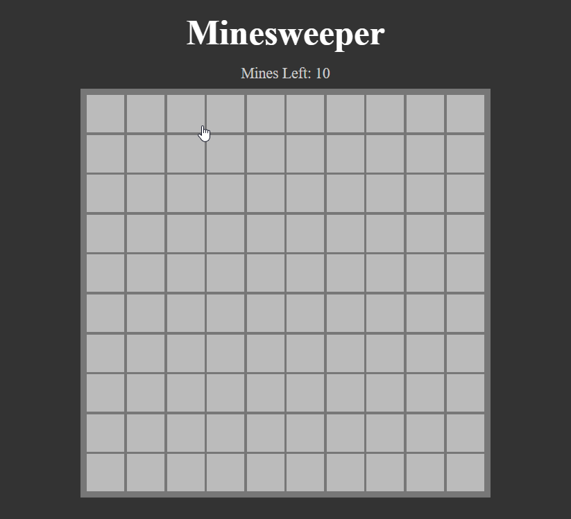
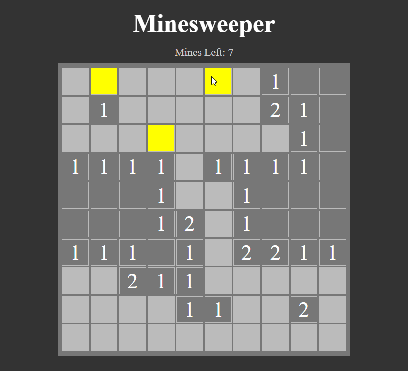
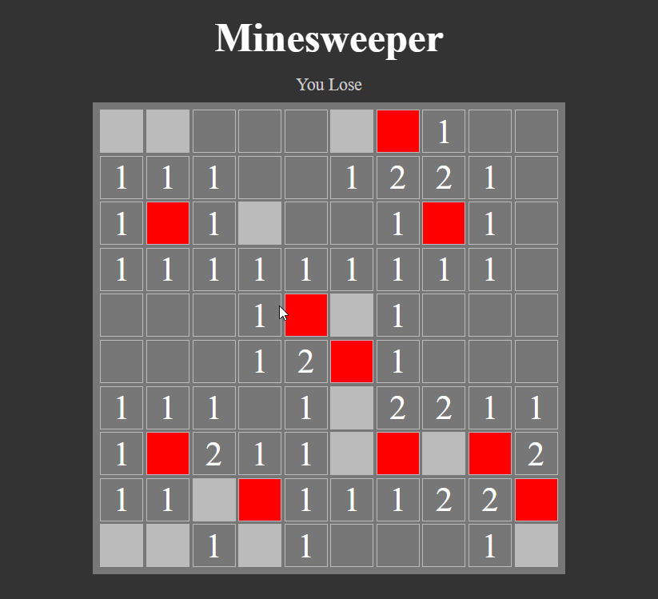

# Mine Sweeper

This Mine Sweeper created using HTML, Javascript, and CSS


## [Live Application](https://minesweeper-typescript-gray.vercel.app/)





## Features

- Player can play this classic mine sweeper game
- Player can put flags on the mines
- Can see win/lose message on top of the game

## Tech Stack
- HTML
- Javascript
- CSS
- Typescript

**Hosting:**
- Vercel


## Run Locally

Clone the project

```bash
  git clone https://gitlab.com/srabon444/minesweeper-typescript.git
```

Install dependencies

```bash
  npm install
```


The Classic Minesweeper game created using HTML, CSS, Javascript, and Typescript